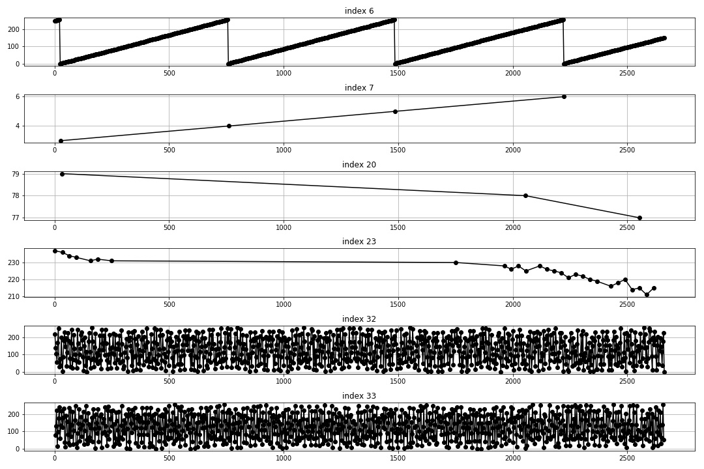

# tellopy

Tello controller library with all perks.

- Connect to 192.168.10.1:8889
- Listen to 192.168.10.2:8889


# Scanning UDP Ports

In `./port-scan` there's an ipython notebook with which you can scan the UDP ports
of your device.  It needs to be executed as root:

```
sudo jupyter notebook --allow-root ./port-scan/scan\ udp\ ports.ipynb
```

The notebook stores the results in a pickled dict by port in
`./port-scan/port-scan.pkl`.


# Manual Control

To start a manual control panel hit:

```
python -m tellopy
```

The functionality requires `PyQt5` and `terminaltables and allows you to
control the drone with your keyboard and mouse using a graphical user
interface.


# How to Establish Video Connection

From https://github.com/SMerrony/tello, we can infer the messages that
need to be send to the tello to activate the video feed:

Function `ControlConnect` let's you send stuff to port 8800 to have joystick
control In there, video is activated to, specifically in tello.go:111
```
	tello.sendConnectRequest(defaultTelloVideoPort)
```
This call refers then to `sendConnectRequest`.  It's necessary to send a
specific request likely to start the video This is done in tello.go:457
```
func (tello *Tello) sendConnectRequest(videoPort uint16) {
	// the initial connect request is different to the usual packets...
	msgBuff := []byte("conn_req:lh")
	msgBuff[9] = byte(videoPort & 0xff)
	msgBuff[10] = byte(videoPort >> 8)
	tello.ctrlMu.Lock()
	tello.ctrlConnecting = true
	tello.ctrlConn.Write(msgBuff)
	tello.ctrlMu.Unlock()
}
```

In video.go:30 the default port for this is specified.  Also the listener is
set up.
```
const (
	defaultTelloVideoPort = 6038
)

// VideoConnect attempts to connect to a Tello video channel at the provided addr and starts a listener.
// A channel of raw H.264 video frames is returned along with any error.
// The channel will be closed if the connection is lost.
func (tello *Tello) VideoConnect(udpAddr string, droneUDPPort int) (<-chan []byte, error) {
	droneAddr, err := net.ResolveUDPAddr("udp", ":"+strconv.Itoa(droneUDPPort))
	if err != nil {
		return nil, err
	}
	tello.videoConn, err = net.ListenUDP("udp", droneAddr)
	if err != nil {
		return nil, err
	}
	tello.videoStopChan = make(chan bool, 2)
	tello.videoChan = make(chan []byte, 100)
	go tello.videoResponseListener()
	//log.Println("Video connection setup complete")
	return tello.videoChan, nil
}
```

Most interestingly, this is how the video stream is parsed in the go version
video.go:66
```
func (tello *Tello) videoResponseListener() {
	for {
		vbuf := make([]byte, 2048)
		if tello.videoConn == nil {
			// must have been closed
			close(tello.videoChan)
			return
		}
		n, _, err := tello.videoConn.ReadFromUDP(vbuf)
		if err != nil {
			log.Printf("Error reading from video channel - %v\n", err)
			close(tello.videoChan)
			return
		}
		select {
		case tello.videoChan <- vbuf[2:n]:
		default: // so we don't block
		}
	}
}
```

## Solution (video connection)

I created a wireless hotspot on my laptop using `Edit Connections...`.  In the
configuration I have the hotspot the ssid `TELLO-C3AB09` -- same as the drone.
I connected my phone to the computer-created hotspot, and started the app.
Using `wireshark`, I was able to spoof out the package sent by the app to
enable rtp and control.  It's the byte string `63 6f 6e 6e 5f 72 65 71 3a 61
1e` translating to b"conn_req:a\x61".  The last two bytes b'a\x61' form `7777`
in uint-16 representation.

Sending this to the tello from the computer, I now started to receive bytes on
port `7777` and also bytes of varying lengths on port `8889`.  Note that
enabling the tello by sending `command` we only receive utf-8 csv bytes on port
`8889`.

## Receiving Control Information

When sending the `b"conn_req.."` stuff to port 8889 of the tello, it also
starts sending UDP packets back to that port on the host.  I started
examining these packets; and I think they contain sensory information.
The packets come in 4 different sizes: 12, 13, 35, and 270 bytes.

The packages could contain something like this:
```
public class FlyControllerEntity
{
  public int batteryLow;
  public int batteryLower;
  public int batteryPercentage;
  public int batteryState;
  public int cameraState;
  public int downVisualState;
  public int droneBatteryLeft;
  public int droneFlyTimeLeft;
  public int droneHover;
  public int eMOpen;
  public int eMSky;
  public int eMgroud;
  public int eastSpeed;
  public int electricalMachineryState;
  public int factoryMode;
  public int flyMode;
  public int flySpeed;
  public int flyTime;
  public int frontIn;
  public int frontLSC;
  public int frontOut;
  public int gravityState;
  public int groundSpeed;
  public int height;
  public int imuCalibrationState;
  public int imuState;
  public int lightStrength;
  public int northSpeed;
  public int outageRecording;
  public int powerState;
  public int pressureState;
  public int smartVideoExitMode;
  public int temperatureHeight;
  public int throwFlyTimer;
  public int wifiDisturb;
  public int wifiStrength;
  public int windState;
}
```

### 12-byte packet

One of these packages looks somewhat like this:
```python
b"\xcc`\x00'\x885\x00\x1b\x00\x01dp"
```

### 35-byte packet

One of these packages looks like so:

```python
 b'\xcc\x18\x01\xb9\x88V\x00\x8c\x01\x00\x00\x00\x00\x00\x00\x00\x00\x00\x00\x00\x00Y\x00\x00P\x10\x00\x01\x00\x00\x00\x00\x00\xab\xdb'
```

Using `numpy`, I transformed the info to `uint8` starting from byte 1 (bytes 0
is always `b'\xcc'`).  Then I recorded the changing bytes and in what package
index the bytes change.  Plotting the two against each other I get the
following picture:



Apparently, index 6 and 7 form a time stamp.
